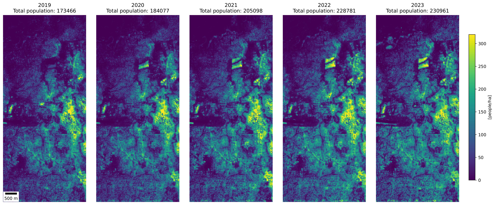
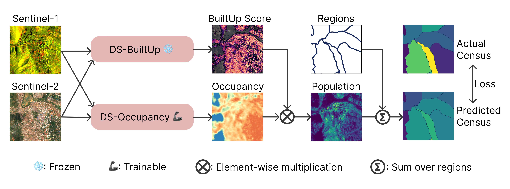

<p align="center">
  
<!--    -->
<!--    -->
<!--    -->
</p>


# POPCORN: High-resolution Population Maps Derived from Sentinel-1 and Sentinel-2

<p align="center">
    <a href="https://nandometzger.github.io/"><strong>Nando Metzger</strong></a><sup>🏦</sup>,
    <a href="https://rcdaudt.github.io/"><strong>Rodrigo Caye Daudt</strong></a><sup>🏦</sup>,
    <a href="https://people.epfl.ch/devis.tuia"><strong>Devis Tuia</strong></a><sup>🍇</sup>,
    <a href="https://igp.ethz.ch/personen/person-detail.html?persid=143986"><strong>Konrad Schindler</strong></a><sup>🏦</sup>
</p>

<p align="center">
  <strong>Affiliations:</strong><br>
  <sup>🏦</sup> Photogrammetry and Remote Sensing, ETH Zürich<br>
  <sup>🍇</sup> Environmental Computation Science and Earth Observation Laboratory, EPFL Sion
</p>

Detailed population maps play an important role in diverse fields ranging from humanitarian action to urban planning. 
Generating such maps in a timely and scalable manner presents a challenge, especially in data-scarce regions.
To address it we have developed POPCORN, a population mapping method whose only inputs are free, globally available satellite images from Sentinel-1 and Sentinel-2; and a small number of aggregate population counts over coarse census districts for calibration.
Despite the minimal data requirements our approach surpasses the mapping accuracy of existing schemes, including several that rely on building footprints derived from high-resolution imagery.
E.g., we were able to produce population maps for Rwanda with 100m GSD based on less than 400 regional census counts. 
In Kigali, those maps reach an $R^2$ score of 66% w.r.t. a ground truth reference map, with an average error of only 10 inhabitants/ha.
Conveniently, POPCORN retrieves explicit maps of built-up areas and of local building occupancy rates, making the mapping process interpretable and offering additional insights, for instance about the distribution of built-up, but unpopulated areas (e.g., industrial warehouses).
Moreover, we find that, once trained, the model can be applied repeatedly to track population changes; and that it can be transferred to geographically similar regions with only a moderate loss in performance (e.g., from Uganda to Rwanda).
With our work we aim to democratize access to up-to-date and high-resolution population maps, recognizing that some regions faced with particularly strong population dynamics may lack the resources for costly micro-census campaigns.



## Methodology

The core of our method is a neural network model, termed POPCORN. That model has two components: (1) a pre-trained, frozen built-up area extractor; and (2) a building occupancy module that we train through weak supervision with coarse census counts, as illustrated in the Figure below.

The model operates at the full Sentinel-1/-2 resolution, i.e., its output has a nominal spatial resolution of 10$\,$m. However, for the final product and evaluation, we recommend aggregating the raw output to a 1ha (100x100m) grid, as done for the evaluation of the paper.



## Setup

# Environment

Instructions on how to install the project or library.

Set up the base environment like this:
```bash
python -m venv PopMapEnv
source PopMapEnv/bin/activate
pip install requirements.txt
```
Additionally, install GDAL without sudo access  as described in this [post](https://askubuntu.com/questions/689065/how-could-i-install-gdal-without-root)
 - download the gdal-3.4.1 binary, and extract it.
 - execute the commands (this might take some time):
```bash
./autogen.sh
./configure
make
```

# Data

All necessary data is available [here](https://drive.google.com/drive/folders/1jExHgmVrIznKRrG2Mc6_d1-6HfyJJUhk?usp=sharing). Place the data into the following folder structure:

```
PopMapData/
├── raw/
│   └── ... (only needed to recompute the dataset processing)
├── processed/
│   ├── che
│   │   ├──census_fine.csv
│   │   ├──boundaries_fine.tif
│   │   ├──census_coarse4.csv
│   │   ├──boundaries_coarse4.tif
│   ├── rwa
│   │   ├──census_coarse.csv
│   │   ├──boundaries_coarse.tif
│   │   ├──census_kigali100.csv
│   │   ├──boundaries_kigali100.tif
│   │   └── ...
│   └── pricp2
│       └── ...
└── merged/
    └── EE/
        ├── che
        │   ├── S1spring
        │   │   └──rwa_S1spring.tif
        │   ├── S1summer
        │   │   └──rwa_S1summer.tif
        │   ├── S1autumn
        │   │   └──rwa_S1autumn.tif
        │   ├── S1winter
        │   │   └──rwa_S1winter.tif
        │   ├── S2Aspring
        │   │   └──rwa_S2Aspring.tif
        │   ├── S2Asummer
        │   │   └──rwa_S2Asummer.tif
        │   └── ...
        ├── rwa
        │   └── ...
        └── pricp2
            └── ...
```

# Testing

## Checkpoints

Checkpoints can be downloaded from ...

## Inference

You can use the 'run_eval.py' script to generate maps and evaluate them subsequently using
```
python run_eval.py --resume ...
```

...

# Training

...


